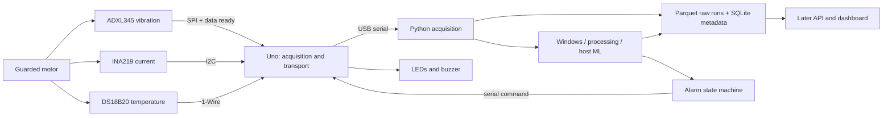

# System and software architecture

> Original design proposal. Current firmware uses bounded FIFO polling (no ISR),
> and readout timestamps. See [the operating guide](../OPERATING-GUIDE.md) and
> [implemented protocol](../protocol/v1.md) for current behavior and limitations.

## Sampling design (proposed, unmeasured)

ADXL345's internal output data rate defines sampling. Target 800 Hz (1.25 ms
period); use data-ready interrupt and investigate FIFO service to tolerate short
host/firmware stalls. An ISR sets a flag/counter only; SPI, formatting and serial
writes run in the main loop. A flag alone cannot count every sample: use FIFO and
overflow diagnostics in Phase 2. Do not confuse repeated register reads with fresh
samples. Begin Phase 1 at 100 Hz ODR with readable output.

Current polling targets 25 Hz initially with conversion-ready/configuration checks;
temperature conversion starts asynchronously, with later retrieval. At 12-bit
resolution DS18B20 conversion can take 750 ms; waiting synchronously would destroy
vibration scheduling. Also measure the interrupt masking of 1-Wire transactions.
Use rollover-safe unsigned elapsed-time arithmetic. A 32-bit microsecond timer wraps
about every 71.6 minutes: the host must distinguish wrap from a new boot/session.

Slow readings are latest-known values, not simultaneous vibration measurements.
Carry validity, age/update indicators and eventually their acquisition timestamps.
Missing/stale is not numeric zero. Document raw-to-unit scale from actual register
configuration and shunt calibration.

## Transport and memory budgets

8N1 serial uses ten wire bits per byte. At 115200 baud capacity is theoretically
11520 bytes/s. An illustrative 60-byte CSV record at 800 Hz needs 48000 bytes/s,
so the Phase 1 console rate is not the production sampling rate.
At 100 Hz the same record needs 6000 bytes/s; measure actual maximum line length.

A hypothetical 32-byte binary frame at 800 Hz needs 25600 bytes/s: 256000 baud
at full utilization, or approximately 366000 baud at 70% utilization. Investigate
500000 baud and sample batching in Phase 3; USB adapter support and sustained
delivery are unverified. Do not freeze a frame format from this illustrative budget.

An 800-sample XYZ int16 window takes 4800 bytes before overhead: it belongs on the
PC. Start budgeting <=256 bytes for acquisition buffers, <=128 bytes for command
parsing, plus library serial/Wire buffers, globals and stack. Proposed total static
SRAM ceiling is 1400 bytes, leaving at least 648 bytes for stack/other use; this is
a review target, not proof of safety. Measure actual stack headroom under load.
Bound serial writes and count any drops instead of silently losing samples.

## Firmware boundaries (added as needed)

- `include/config.h`: pin/rate/transport settings; `types.h`: fixed-width records;
  `protocol.h`: versioned constants once transport is designed.
- `src/main.cpp`: initialization and cooperative scheduling only.
- `src/sensors/{accelerometer,current,temperature}.{h,cpp}`: register access,
  configuration, health and raw readings.
- `src/acquisition/sampler.{h,cpp}`: interrupt/FIFO service, timestamps and queues.
- `src/communication/serial_protocol.{h,cpp}`: bounded parser, framing and ACKs.
- `src/actuators/alarm.{h,cpp}`: idempotent output states and communication timeout.
- `src/filters/`: only justified streaming embedded filters; main DSP is on host.

## Python boundaries (added as needed)

- `acquisition/serial_reader.py`, `parser.py`, `reconnect.py`: one serial owner,
  byte decoding, sessions, receipt times and backoff.
- `processing/`: filters, windows, FFT and features consume validated records.
- `storage/`: explicit schemas, run metadata, bounded writes and repositories.
- `ml/`: grouped training/evaluation and versioned inference artifacts.
- Future state machine owns persistence; command sender owns IDs, ACK timeout/retry.
- `api/` and dashboard read derived state without owning the serial port.

Bound queues; choose and log an explicit overflow policy. Preserve raw readings
before transformations. Device and PC clocks are different: subtracting their
timestamps is not a valid one-way latency measurement without synchronization.
Report host-stage durations with a monotonic clock and physical end-to-end latency
with a common observable trigger when possible.
