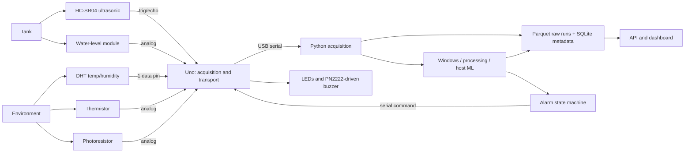

# System and software architecture

> Pivoted from the original motor/vibration proposal to a tank/environmental
> design — see [ADR-008](../decisions/ADR-008-sensor-set-pivot.md). Current
> firmware polls all sensors cooperatively (no ISR, no FIFO) and assembles one
> report per second. See [the operating guide](../OPERATING-GUIDE.md) and
> [implemented protocol](../protocol/v1.md) for current behavior and limitations.

## Sampling design

No high-rate waveform exists in this design, so there is no ISR/FIFO scheduling
problem to solve. Each sensor is polled cooperatively at its own practical rate:
HC-SR04 every ~150 ms (its physical minimum is ~60 ms; margin avoids echo
interference between pings), DHT every ~2 s (covers both DHT11's 1 s and DHT22's
2 s minimum), water-level/thermistor/photoresistor are instant `analogRead()`s
taken fresh each report cycle. Once per second (`kReportIntervalMs`), the sampler
assembles the latest value from each sensor into one `Sample` and transmits it —
regardless of which underlying poll cycle produced that value.

Slow readings are latest-known values, not simultaneous measurements. Only the
two sensors with real transient-failure modes (HC-SR04 echo timeout, DHT checksum
failure) carry an explicit age/validity flag; the plain analog reads are always
fresh by construction. Missing/stale is not numeric zero — it's flagged instead.
Use rollover-safe unsigned elapsed-time arithmetic throughout (`millis()` wraps
about every 49.7 days; the host must distinguish wrap from a new boot/session).

## Transport budget

8N1 serial uses ten wire bits per byte. A 29-byte DATA frame plus a 10-byte
STATUS frame once per second is roughly 40-50 bytes/s including framing overhead
— trivial against 115200 baud's ~11520 bytes/s capacity. There is no batching,
no FIFO-overflow risk, and no reason to raise the baud rate; revisit only if a
future sensor addition materially changes this math.

## Firmware boundaries

- `include/config.h`: pins, poll intervals, baud; `types.h`: the `Sample` record;
  `protocol.h`: versioned transport constants.
- `src/main.cpp`: initialization and cooperative scheduling only.
- `src/sensors/{ultrasonic,water_level,ambient,analog_environment}.{h,cpp}`:
  per-sensor polling, health and raw readings.
- `src/acquisition/sampler.{h,cpp}`: once-per-second assembly of the latest
  reading from each sensor into one `Sample`.
- `src/communication/serial_protocol.{h,cpp}`: bounded parser, framing and ACKs.
- `src/actuators/alarm.{h,cpp}`: idempotent output states and communication
  timeout; the buzzer output is now driven through a PN2222 (hardware-only change).

## Python boundaries

- `acquisition/`: one serial owner, byte decoding, sessions, receipt times and
  backoff (`runner.py`), plus framing/parsing (`protocol.py`).
- `processing/`: windowing and slow-signal features (mean/slope/range/std per
  channel, plus cross-sensor agreement) consume validated records — no FFT.
- `storage/`: explicit schemas, run metadata, bounded writes and repositories.
- `ml/`: grouped training/evaluation and versioned inference artifacts.
- State machine owns persistence; command sender owns IDs, ACK timeout/retry.
- `api/` and dashboard read derived state without owning the serial port.

Bound queues; choose and log an explicit overflow policy. Preserve raw readings
before transformations. Device and PC clocks are different: subtracting their
timestamps is not a valid one-way latency measurement without synchronization.
Report host-stage durations with a monotonic clock and physical end-to-end latency
with a common observable trigger when possible.
