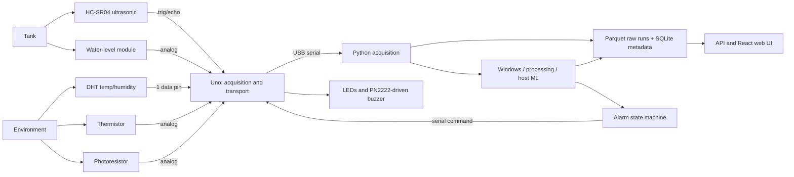

# System and software architecture

> Pivoted from the original motor/vibration proposal to a tank/environmental
> design — see [ADR-008](../decisions/ADR-008-sensor-set-pivot.md). Current
> firmware polls all sensors cooperatively (no ISR, no FIFO) and assembles one
> report per second. See [the operating guide](../OPERATING-GUIDE.md) and
> [implemented protocol](../protocol/v1.md) for current behavior and limitations.

```mermaid
flowchart LR
  T[Tank] --> H[HC-SR04 ultrasonic]
  T --> W[Water-level module]
  E[Environment] --> D2[DHT temp/humidity]
  E --> R[Thermistor]
  E --> L[Photoresistor]
  H -->|trig/echo| U[Uno: acquisition and transport]
  W -->|analog| U
  D2 -->|1 data pin| U
  R -->|analog| U
  L -->|analog| U
  U -->|USB serial| D[Python acquisition]
  D --> P[Windows / processing / host ML]
  D --> S[Parquet raw runs + SQLite metadata]
  P --> S
  P --> C[Alarm state machine]
  C -->|serial command| U
  U --> B[LEDs and PN2222-driven buzzer]
  S --> V[API and React web UI]
```

## Sampling design

No high-rate waveform exists in this design, so there is no ISR/FIFO scheduling
problem to solve. Each sensor is polled cooperatively at its own practical rate:
HC-SR04 every ~150 ms (its physical minimum is ~60 ms; margin avoids echo
interference between pings), DHT every ~2 s (covers both DHT11's 1 s and DHT22's
2 s minimum), water-level/thermistor/photoresistor are instant `analogRead()`s
taken fresh each report cycle. Once per second (`kReportIntervalMs`), the sampler
assembles the latest value from each sensor into one `Sample` and transmits it —
regardless of which underlying poll cycle produced that value.

Slow readings are latest-known values, not simultaneous measurements. Only the
two sensors with real transient-failure modes (HC-SR04 echo timeout, DHT checksum
failure) carry an explicit age/validity flag; the plain analog reads are always
fresh by construction. Missing/stale is not numeric zero — it's flagged instead.
Use rollover-safe unsigned elapsed-time arithmetic throughout (`millis()` wraps
about every 49.7 days; the host must distinguish wrap from a new boot/session).

## Transport budget

8N1 serial uses ten wire bits per byte. The 29-byte DATA and 10-byte STATUS
figures are *payload* sizes; each frame adds 7 bytes of framing (2 magic, version,
type, length, 2 CRC), so on the wire they are 36 and 17 bytes. One of each per
second is about 53 bytes/s from the Uno (ACK replies to host commands are 11 bytes
each and are extra) — under 0.5% of 115200 baud's ~11520 bytes/s capacity. There is no batching,
no FIFO-overflow risk, and no reason to raise the baud rate; revisit only if a
future sensor addition materially changes this math.

## Firmware boundaries

- `include/config.h`: pins, poll intervals, baud; `types.h`: the `Sample` record;
  `protocol.h`: versioned transport constants.
- `src/main.cpp`: initialization and cooperative scheduling only.
- `src/sensors/{ultrasonic,water_level,ambient,analog_environment}.{h,cpp}`:
  per-sensor polling, health and raw readings.
- `src/acquisition/sampler.{h,cpp}`: once-per-second assembly of the latest
  reading from each sensor into one `Sample`.
- `src/communication/serial_protocol.{h,cpp}`: bounded parser, framing and ACKs.
- `src/actuators/alarm.{h,cpp}`: output states (0 NORMAL green, 1 WARNING amber,
  2 FAULT red plus buzzer, 3 UNKNOWN amber) and the host-silence timeout. The
  buzzer sits on D8 behind a PN2222 and is driven with `tone()` at 2500 Hz (passive
  piezo). If no valid host command arrives for 3 s, any state other than FAULT
  becomes UNKNOWN; FAULT survives host silence. This is not a hard latch: any host
  `SET_ALARM` (0-3) or `CLEAR_ALARM` in `serial_protocol.cpp` overwrites the state,
  including FAULT, and the host sends `SET_ALARM(3)` (UNKNOWN) after a reconnect
  because its own state resets to UNKNOWN. Commands are idempotent: repeating the
  same one leaves the same state.

## Python boundaries

All under `python/sentinel/`:

- `acquisition/`: `protocol.py` (frame codec, `Parser`, `Sample`, `Continuity`),
  `commands.py` (command IDs, ACK timeout/retry), `csv_protocol.py` (V0 debug
  parser) and `simulator.py` (byte-level device simulator).
- `runner.py` (top level, not under `acquisition/`): the acquisition run loop. One
  serial-owner thread reads bytes into a bounded queue; the run loop decodes,
  sends commands, and drives `pipeline.py`. It also handles receipt times and
  reconnect backoff.
- `pipeline.py`, `processing/` (`windows.py`, `features.py`): unit conversion with
  calibration constants, windowing and slow-signal features (mean/slope/range/std
  per channel, plus cross-sensor agreement) over validated records — no FFT.
- `state.py`: persistence/hysteresis state machine.
- `storage/database.py`: the `Store` class (run metadata, raw Parquet chunks,
  feature windows, predictions, events, alarm-ack bookkeeping) and `audit()`;
  `storage/status.py`: atomic `status.json` publishing. There is no separate
  repository layer.
- `ml/`: grouped training/evaluation and versioned inference artifacts.
- `api/main.py` and the React frontend read stored/derived state without owning
  the serial port.

Queues are bounded (128 incoming chunks, 16 outgoing frames). The overflow policy
is drop-and-count: a full queue increments `queue_drops` in the run summary and
`status.json`; the drop is not logged, so only that counter shows it. Preserve raw readings
before transformations. Device and PC clocks are different: subtracting their
timestamps is not a valid one-way latency measurement without synchronization.
Report host-stage durations with a monotonic clock and physical end-to-end latency
with a common observable trigger when possible.
